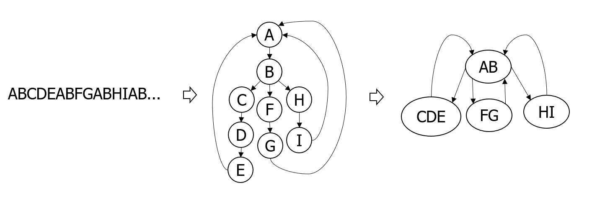
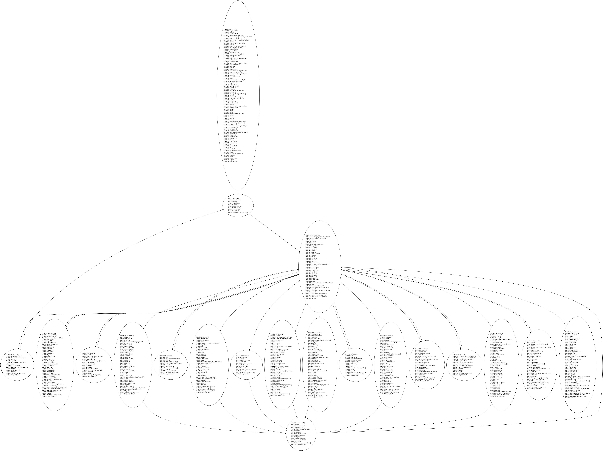

# 序言

系列第1篇对一个极弱的虚拟机 VMProtect 1.81 Demo 版进行了分析，初步展示了一下对虚拟机保护代码的分析方法。

Demo 版因为代码没有混淆处理，因此在 IDA 中可以分析的很清楚了，甚至还可以根据字节码（VM_DATA）一点点静态还原虚拟指令。

然而正式版本的 VMProtect 虚拟机是有比较严重的混淆的（实际是一种冗余指令的添加），直接使用 IDA 分析十分困难，许多基本块会截断，也没有第1篇中介绍的明显的解释循环图结构。动态调试也不方便，里面大量的CALL\JMP，跳来跳去。ESI 还有指令的立即数等还有加密，整体复杂度有很大的提升。

对于这种情况如何处理呢？本文以 VMProtect 2.13.8 为例，展示如何在混淆比较严重的情况下找到虚拟机关键结构、快速的分析 Handler，提取出虚拟指令。

本文主要介绍两个关键的部分：
- 通过 Trace 分析快速把握虚拟机结构
- 通过符号执行快速分析 Handler

# VMProtect 2.13.8 样本说明

这里使用的样本仍是第1篇中的代码加 VM 的。

```
sub_401000 proc near
mov     eax, dword_403000
add     eax, 12345678h
sub     eax, 12345678h
mov     dword_403000, eax
retn
sub_401000 endp
```

加密级别为**最大速度**，目前我们只讨论虚拟机本身，其他诸如IAT保护、反调试等其他 VMP 保护选项都关闭，让我们专注于虚拟机的分析。

其实即使到了 2.13.8 版本， VMProcect 的整体结构仍是和 VMProtect 1.81 一致的。 因此虽然存在混淆，经验丰富的人还是可以迅速找到关键的指令分发点（Dispatcher）位置，从而找到跳转表，提取所有的 Handler。

如下指令（加*的部分）就是典型的 dispatcher 代码，根据 0x404cf8 跳转表，再找到 ESI 解密的方式，就可以提取所有 Handler。
```
0x4041ff        mov edx, dword ptr [eax*4+0x404cf8]  ;*****
0x404206        cmc
0x404207        sub edx, 0x1aadee33
0x40420d        mov byte ptr [esp+0x8], 0x28
0x404212        pushad
0x404213        mov dword ptr [esp+0x40], edx        ; ******
0x404217        pushfd
0x404218        mov byte ptr [esp+0x4], ch
0x40421c        push dword ptr [esp+0x8]
0x404220        push dword ptr [esp+0x48]
0x404224        ret 0x4c                             ; ******
```

这是前人总结出来的特征。如果是不了解 VMProtect 的人，分析起来就要困难一些。

如果我们对 VMProtect 并不十分清楚，直接面对 VMProtect 2.13.8 版本的样本该如何处理？

# 虚拟机结构分析

首先仍 IDA 打开样本，跳到 0x401000 处，看下前几条指令：

```
.text:00401000                 jmp     loc_405DD8  ; 跳转到 .vmp0 中的虚拟机代码

.vmp0:00405DD8                 pushf
.vmp0:00405DD9                 call    sub_405CF7  ; call并不是函数调用，只是跳转进入虚拟机中

.vmp0:00405CF7                 mov     byte ptr [esp+0], 0A4h
.vmp0:00405CFB                 mov     dword ptr [esp+4], 95A00657h
.vmp0:00405D03                 mov     [esp+0], dl
.vmp0:00405D06                 mov     dword ptr [esp+0], 6B1DA363h
.vmp0:00405D0D                 pusha
.vmp0:00405D0E                 push    dword ptr [esp+8]
.vmp0:00405D12                 pusha
.vmp0:00405D13                 mov     [esp+20], al
.vmp0:00405D17                 lea     esp, [esp+44h] ; 前面压栈的内容弹出来
.vmp0:00405D1B                 jmp     loc_4048F4

.vmp0:004048F4                 jmp     loc_40593D

...
```

其实这些代码并没有什么有用的操作，先向栈中压入一些无用的数据，然后又通过 `lea  esp, [esp+44h]` 把栈顶降回来，相当于把压入的数据弹出来，结果就是什么都没有做。同时使用了大量的 jmp 和 call 将代码切割成若干小块，使 IDA 无法正常分析。

我们还是很喜欢第1篇中的 IDA 生成的控制流图的。通过图中明显的解释循环结构，可以很快的定位哪里是 Dispatcher，哪里是 Handler。但现在 jmp 和 call 干扰了 IDA 的分析，IDA 没法生成完整的 CFG 图。

为了恢复这个图，我们还是使用 Trace 分析的方法。Trace 是 x86 指令执行的序列，Trace 中所有 jmp 和 call 会天然的和跳转目标指令连接起来。Trace 分析其实是很强大的功能。单步执行时我们的注意力可能会被寄存器、内存的值所分散，而忽略了程序整体的执行情况。而通过对 Trace 的整体分析，则可以让我们跳出局部，从整体去观察。

虚拟机解释执行的过程是一个循环：首先取指令，解码，然后跳转到 Handler 代码，执行完成后再跳转回来。在 Trace 中我们如何捕捉这个关键的循环？我想到的方法是，由 Trace 构造一个像之前 IDA 显示的 CFG 图类似的图。 通过找图中的中心结点，来确定 dispatcher 的位置。

由 Trace 构造的图，是反映了程序执行过程的基本块图，我们可以称之为**执行流图**。构造图的方法说起来比较费力，直接看图。



假设ABCD是执行的指令序列，按照每条指令在Trace中的先后顺序，就可以构造一个图。相邻结点合并一下，就可以得到最终的执行流图。最终 AB 形成一个块，执行到 CDE 块，再跳转回来，再执行FG块，再跳转回来，再执行HI块，再跳转回来。整个执行的过程就很清楚了。通过写脚本分析 OD 的 Trace 文件，就可以构造出这个图，编程有基础的同学实现一下并不困难。

我做过一个工具，具备生成这种图的功能。不过为了 Trace 的效率，这个工具没有使用 OD Trace，而是利用 Intel 的插装工具 Pin 记录指令序列。（这个工具还在写，目前比较渣，不多介绍了。如果写好了会单独写文章介绍。想尝鲜可以自己下载下来编译源码，传送门在 https://github.com/lmy375/pinvmp ）

下面是用这个工具分析 VMP 样本生成的执行流图。



(图太大无法显示清楚，看得清基本的结构就好，完整的SVG格式图见附件)

这回已经非常直观了。图中间的结点跳转到其他结点中再跳转回来，是典型的 dispatcher 结构，并列成排的每个代码块，就是 Handler 代码块。

dispatcher 结点的代码如下：
```
0x40435f        lea edx, ptr [edx*8-0x7525bb7f]
0x404366        mov al, byte ptr [esi-0x1]     ; [esi - 0x1] 取指令
0x404369        inc dl
0x40436b        setns dh
0x40436e        dec esi
0x40436f        sub edx, 0x9ec1cfd2
0x404375        cmp dl, 0xea
0x404378        rcl dl, 0x7
0x40437b        sub al, bl  ; 解密 al
0x40437d        dec dl
0x40437f        push esi
0x404380        call 0x4041ce
0x4041ce        pop edx
0x4041cf        dec al      ; 解密 al
0x4041d1        rcl dh, cl
0x4041d3        sar edx, cl
0x4041d5        or dl, ch
0x4041d7        xor al, 0xcd  ; 解密 al
0x4041d9        lea edx, ptr [ebx*8-0xcbcbf63]
0x4041e0        sar dx, cl
0x4041e3        rcr edx, 0x10
0x4041e6        rol dx, cl
0x4041e9        sub al, 0x23
0x4041eb        shl dl, cl
0x4041ed        bsr dx, dx
0x4041f1        bt bx, 0x9
0x4041f6        sub bl, al
0x4041f8        rcl dh, 0x4
0x4041fb        movzx eax, al  ; eax <- al
0x4041fe        pushad
0x4041ff        mov edx, dword ptr [eax*4+0x404cf8]  ; 取跳转地址， 跳转表就是 0x404cf8
0x404206        cmc
0x404207        sub edx, 0x1aadee33  ; 解密跳转地址
0x40420d        mov byte ptr [esp+0x8], 0x28
0x404212        pushad
0x404213        mov dword ptr [esp+0x40], edx  ; 跳转地址压栈
0x404217        pushfd
0x404218        mov byte ptr [esp+0x4], ch
0x40421c        push dword ptr [esp+0x8]
0x404220        push dword ptr [esp+0x48]
0x404224        ret 0x4c  ; 通过 ret 跳转到前面压栈的 edx
```
除了注释外的代码，大多是混淆作用，不用关心。


# Handler 分析

接下来看 Handler 代码。当然我们也可以一个一个人工分析 Handler 代码。因为 VMProtect 的混淆没有代码变形，只是添加了很多的栈指令。

因为原本的代码没变，人工分析也不困难，对于了解 VMP 的人，即使人工分析，分析每个Handler也不会太困难。

然而如果不了解 VMP Handler 的特征，看这种混淆代码是很痛苦的。

这里介绍一种利用符号执行分析 Handler 的方法。（参考：http://www.miasm.re/blog/2016/09/03/zeusvm_analysis.html）

首先简单说明一下什么是符号执行。符号执行是将所有寄存器和内存当作符号变量，然后模拟执行所有语句。执行完毕后，每个寄存器和写入的内存都会变成符号表达式。

比如如下代码
```
add eax, 1   ; eax = eax_init + 1
add ebx, eax ; ebx = ebx_init + eax 
sub ebx, eax ; ebx = ebx_init + eax - eax = ebx_init
add ebx, ecx ; ebx = ebx_init + ecx_init
```
记eax和ebx的值是`eax_init`和`ebx_init`。符号执行会将每条指令翻译成对应的语义表达式。执行过程如注释说明。

最终的结果
```
eax = eax_init + 1
ebx = ebx_init + ecx_init
ecx = ecx_init
```
说明执行了上述代码， eax 增加了初始值的 1；ebx 变成 ebx 初始值加 ecx；ecx 还是初始值不变。值得注意的是 ebx 加 eax 又减 eax 这个过程没有显示在最终的结果里，符号执行引擎把结果化简了。**VMP 添加的指令就是这类不影响最终结果的指令，因此可以被符号执行引擎化简掉**。

下面证明我们的想法。

使用 Miasm 这个符号执行引擎去分析混淆的代码。（Miasm：https://github.com/cea-sec/miasm）

以如下的 Handler 代码块为例：
```
0x40493f        shr al, 0x5
0x404942        sbb al, 0x8b
0x404944        stc
0x404945        movzx eax, byte ptr [esi-0x1]
0x404949        pushad
0x40494a        stc
0x40494b        xor al, bl
0x40494d        jmp 0x404b01
0x404b01        clc
0x404b02        clc
0x404b03        not al
0x404b05        pushad
0x404b06        cmc
0x404b07        xor al, 0xc1
0x404b09        clc
0x404b0a        mov dword ptr [esp], 0xba247870
0x404b11        jmp 0x405123
0x405123        ror al, 0x5
0x405126        pushfd
0x405127        call 0x4051f2
0x4051f2        cmp al, 0x15
0x4051f4        bt sp, bp
0x4051f8        xor bl, al
0x4051fa        clc
0x4051fb        sub ebp, 0x2
0x4051fe        mov byte ptr [esp], 0x64
0x405202        mov byte ptr [esp], 0x14
0x405206        pushfd
0x405207        jmp 0x405bde
0x405bde        dec esi
0x405bdf        pushfd
0x405be0        mov word ptr [ebp], ax
0x405be4        mov word ptr [esp], bp
0x405be8        mov byte ptr [esp], dl
0x405beb        lea esp, ptr [esp+0x50]
0x405bef        jmp 0x4059a4
```

我们把所有跳转指令去掉，当作一个连续的代码块。然后把每条指令的二进制字节提取出来，拼接在一起，十进制表示如下：
```
c0e8051c8bf90fb646ff60f930d890f8f8f6d060f534c1f8c70424707824ba90c0c8059c682c5140003c15660fa3ec30c3f883ed02c6042464c60424149c904e9c6689450066892c248814248d64245090
```

之所以转化成二进制是为了方便使用 Miasm 进行符号执行（代码参考：https://github.com/lmy375/pinvmp/blob/master/py/symexec.py ）

符号执行后，可以输出如下结果：
```
EBP = EBP_init + 0xFFFFFFFE;
ESI = ESI_init + 0xFFFFFFFF;
@16[EBP_init + 0xFFFFFFFE] = {(@8[ESI_init + 0xFFFFFFFF] ^ EBX_init[0:8] ^ 0x3E) >>> 0x5 0 8, 0x0 8 16};
... （还有其他ESP内存相关的表达式，忽略）
```
上面的表达式是Miasm使用的表达式 其中`@` 表示内存访问。上面的表达式的含意就是，执行上面的Handler 后。
- EBP 会减2（说明压栈2字节）
- ESI 会减1（vEIP移动1字节）
- [ebp - 2]的2字节，会写入值 ([esi -1] ^ ebx ^ 0x3e) 再循环右移 0x5 的结果。（说明是取指令立即数，解码后然后压入栈中）

因此可以很容易的确定这条指令是 vPushImm1。

这样分析起来就容易了非常多。（后面有时间会写一篇利用符号执行处理 Code Virtualizer 混淆的例子，效果也十分明显！）

很方便就可以分析出每条 Handler。

# 提取伪指令及伪指令分析

分析完每条 handler 后，就可以从 Trace 中取出 Handler 的调用序列。

方法和第1篇一样，首先用 OD2 跑 Trace，再写脚本还原伪代码。

同样的对于需要使用寄存器或者立即数的指令，需要额外处理一下。

比如前面的 `vPushImm1` Handler，只要查找 Trace 中`0x405be0        mov word ptr [ebp], ax` 中 ax 的值，就可以知道具体的立即数压入的值是多少了。

而对于 push 和 pop 指令 我们这次除了从Trace中提取出寄存器下标，还提取出读写的寄存器值，方便我们分析伪代码。

VMProtect 2.13.8 相对之前的 Demo 版本，不但虚拟机内部混淆有明显增强，关键是伪代码级别变得更加难复杂了。（这其实才是 VMP 强度的关键）

其实伪代码也是可以利用前面介绍的符号执行方法进行分析，不过需要自行处理伪指令的语义（后面有空的话会专门写东西讲利用符号执行分析伪指令）

这里简单人肉分析一下：

```
// 这个代码块人肉看会比较痛苦
// 我也没有具体看
// 不过根据低版本的伪码应该是对 eflag 中的 trap 位进行检查的代码。
vPopReg4        R9      = 0x0
vPushImm4       0xc34f4e9
vAdd4
vPopReg4        R14     = 0x4046a7
vPopReg4        R4      = 0xc34f72f
vPopReg4        R5      = 0x404558
vPopReg4        R2      = 0x396622ad
vPopReg4        R6      = 0x401015
vPopReg4        R13     = 0x401015
vPopReg4        R7      = 0x307000
vPopReg4        R11     = 0x401015
vPopReg4        R10     = 0x401015
vPopReg4        R12     = 0x401015
vPopReg4        R14     = 0x19ff94
vPopReg4        R3      = 0x6b1da363
vPopReg4        R3      = 0x95a00657
vPushReg4       R5      = 0x404558
vPushImm4       0x2d47169f
vPushImm4       0x2d47150d
vPushImmSx2     0xfffffeff
vPushReg4       R5      = 0x404558
vPushVESP
vReadMemSs4
vNor4
vPopReg4        R8      = 0x203a21fc
vNor4
vPopReg4        R15     = 0x203a21fc
vPopReg4        R1      = 0x100
vPushVESP
vPushImm1       0x4
vPushReg4       R15     = 0x203a21fc
vPushVESP
vReadMemSs4
vNor4
vPopReg4        R8      = 0x203a21fc
vPushImmSx4     0xffffffbf
vNor4
vPopReg4        R5      = 0x203a21fc
vShr4
vPopReg4        R3      = 0x202
vAdd4
vPopReg4        R1      = 0x4046a7
vReadMemSs4
vPopReg4        R5      = 0x2d47169f
vPopReg4        R8      = 0x2d47150d
vPopReg4        R8      = 0x2d47169f
vPushReg4       R5      = 0x2d47169f
vPopReg4        R1      = 0x2d47169f
vPushReg4       R1      = 0x2d47169f
vPushReg4       R1      = 0x2d47169f
vNor4
vPopReg4        R3      = 0x203a21fc
vPushImm4       0xd2f8b4b8
vNor4
vPopReg4        R5      = 0x203a21fc
vPushImm4       0x2d074b47
vPushReg4       R1      = 0x2d47169f
vNor4
vPopReg4        R3      = 0x203a21fc
vNor4
vPopReg4        R3      = 0x203a21fc
vPopReg4        R3      = 0x405dd8

vPushReg4       R10     = 0x401015
vPushReg4       R7      = 0x307000
vPushReg4       R13     = 0x401015
vPushReg4       R10     = 0x401015
vPushReg4       R14     = 0x19ff94
vPushReg4       R5      = 0x203a21fc
vPushReg4       R11     = 0x401015
vPushReg4       R12     = 0x401015
vPushReg4       R2      = 0x396622ad
vPushReg4       R15     = 0x203a21fc
vPushReg4       R7      = 0x307000

vPushReg4       R4      = 0xc34f72f
vPushImm4       0xf3cb0b17
vAdd4
vPopReg4        R5      = 0x4046a7
vPushReg4       R9      = 0x0

vPushReg4       R3      = 0x405dd8 ; 跳转目标
vJmp

// 初始化
vPopReg4        R14     = 0x0
vPushImm4       0xc34f4e9
vAdd4
vPopReg4        R10     = 0x4046a7
vPopReg4        R3      = 0xc34f72f
vPopReg4        R7      = 0x307000
vPopReg4        R8      = 0x203a21fc
vPopReg4        R12     = 0x396622ad
vPopReg4        R2      = 0x401015
vPopReg4        R9      = 0x401015
vPopReg4        R10     = 0x203a21fc

vPushReg4       R10     = 0x203a21fc
vPushReg4       R10     = 0x203a21fc
vNor4
vPopReg4        R6      = 0x203a21fc
vPushImm4       0xd2f8b4b8
vNor4
vPopReg4        R1      = 0x203a21fc
vPushImm4       0x2d074b47
vPushReg4       R10     = 0x203a21fc
vNor4
vPopReg4        R5      = 0x203a21fc
vNor4
vPopReg4        R6      = 0x203a21fc
vPopReg4        R6      = 0xd3d6abb
vPopReg4        R0      = 0x19ff94
vPopReg4        R15     = 0x401015
vPopReg4        R1      = 0x401015
vPopReg4        R13     = 0x307000
vPopReg4        R11     = 0x401015
vPopReg4        R5      = 0x404558
vPushReg4       R5      = 0x404558
vPushReg4       R5      = 0x404558
vNor4
vPopReg4        R8      = 0x203a21fc
vPushImmSx2     0x8ff
vNor4


// mov     eax, dword_403000
vPushImm4       0x403000
vReadMem4
vPopReg4        R8      = 0xdeadbeef
vPopReg4        R12     = 0x203a21fc

// add     eax, 12345678h
vPushImm4       0x12345678
vPushReg4       R8      = 0xdeadbeef
vAdd4
vPopReg4        R4      = 0x4046a7
vPopReg4        R11     = 0xf0e21567
vPopNULL4
vPushReg4       R0      = 0x19ff94
vPushReg4       R2      = 0x401015

// sub     eax, 12345678h
vPushImm4       0x12345678
vPushReg4       R11     = 0xf0e21567
vPushVESP
vReadMemSs4
vNor4
vPopReg4        R8      = 0x203a21fc
vAdd4
vPopReg4        R4      = 0x4046a7
vPushVESP
vReadMemSs4
vNor4
vPopReg4        R12     = 0x203a21fc
vPopReg4        R13     = 0xdeadbeef  ; result

// flag
vPushReg4       R4      = 0x4046a7
vPushVESP
vReadMemSs4
vNor4

// mov     dword_403000, eax
vPushReg4       R13     = 0xdeadbeef
vPushImm4       0x403000
vWriteMem4

// flag
vPopReg4        R11     = 0x203a21fc
vPushImmSx2     0xfffff7ea
vNor4
vPopReg4        R5      = 0x203a21fc
vPushReg4       R12     = 0x203a21fc
vPushReg4       R12     = 0x203a21fc
vNor4
vPopReg4        R6      = 0x203a21fc
vPushImmSx2     0x815
vNor4
vPopReg4        R11     = 0x203a21fc
vAdd4
vPopReg4        R8      = 0x4046a7
vPopReg4        R8      = 0x203a21ed

// ret
vPushReg4       R15     = 0x401015
vPushReg4       R9      = 0x401015
vPushReg4       R7      = 0x307000
vPushReg4       R1      = 0x401015
vPushReg4       R12     = 0x203a21fc
vPushReg4       R13     = 0xdeadbeef
vPushReg4       R8      = 0x203a21ed
vPushReg4       R15     = 0x401015
vPushReg4       R13     = 0xdeadbeef
vRet
```

# 总结

本篇介绍了利用 Trace 和符号执行分析 VMProtect 2.13.8 的方法。其实只是大概提下思路，想要完全自动化分析还有很长的路要走。

Trace 分析这种方法对混淆代码其实还是不错的，动态运行信息有了，比静态看 IDA 要好很多。但这种方法也是有局限的，首先Trace 文件可能会非常大，处理起来很麻烦。另一方面 Trace 只记录跑过的指令，没有跑过的代码 Trace 是分析不到的。就像文中所述，这个VMP样本使用 Trace 大概只能提取到 20 多个 Handler，因为样本实际只用到了这么多。

符号执行是个新东西。对于学术界可能不新了，但是开始出现好用的实用工具如 angr, miasm, triton 等也是近年的事。这种新方法如果应用到虚拟机保护上也许会有奇效。

（文章涉及的样本、IDB文件、Trace文件、部分脚本见附件，密码123456）


Moon
2018/04/08